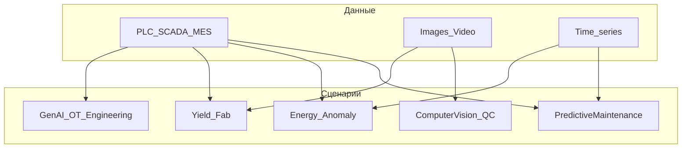

# Саммари: исследование кейсов «нейросети / ИИ на производстве»

**Дата:** 2026-05-01
**Связанные материалы:** [Поисковые_запросы_ИИ_производство.md](../Поисковые_запросы_ИИ_производство.md) (чек-лист и журнал)

---

## Индекс принятых кейсов (только производственный контур)

| Файл кейса                                                             | Компания / объект        | Страна         | Отрасль                           | Сценарий                     | Ключевая метрика (если есть)                                        | Источник (тип)                                 |
| ---------------------------------------------------------------------- | ------------------------ | -------------- | --------------------------------- | ---------------------------- | ------------------------------------------------------------------- | ---------------------------------------------- |
| [Кейс_15](../Кейс_15_BMW_NVIDIA_AIQX_производство.md)                  | BMW Group                | DE / глобально | Авто                              | CV QA, MLOps, synthetic data | 8× productivity data science; QA time −> two-thirds; 4–6× vs legacy | NVIDIA + Axis (`vendor`)                       |
| [Кейс_16](../Кейс_16_Foxconn_Huawei_CV_QC.md)                          | Foxconn                  | —              | Электроника                       | CV QC                        | >6000 ед/мес; >99% accuracy                                         | Huawei (`vendor`)                              |
| [Кейс_17](../Кейс_17_Unilever_Hefei_OEE_digital_twin.md)               | Unilever Хэфэй           | CN             | FMCG                              | OEE, digital twin, PdM       | OEE +8 п.п.; batch cycle −15%; wastage до −20%                      | Unilever (`customer`)                          |
| [Кейс_18](../Кейс_18_ArcelorMittal_Belgium_Axis_CV_сталь.md)           | ArcelorMittal Belgium    | BE             | Металлургия                       | CV + safety + QA             | метрики не раскрыты                                                 | Axis (`vendor`)                                |
| [Кейс_19](../Кейс_19_TSMC_Intelligent_Packaging_Fab_AI_yield.md)       | TSMC Adv. Packaging      | TW             | Полупроводники                    | Yield defense, ADC, ML       | публичные % yield в источнике нет                                   | TSMC (`customer`)                              |
| [Кейс_20](../Кейс_20_Schaeffler_Siemens_Industrial_Copilot_PLC.md)     | Schaeffler + Siemens     | DE             | Машиностроение                    | GenAI для PLC / поддержка    | числа не раскрыты                                                   | Siemens + Schaeffler (`vendor`)                |
| [Кейс_21](../Кейс_21_Nestle_Axis_process_video_пищевое.md)             | Nestlé (FR sites)        | FR             | Пищевое                           | Процессное видео, ATEX       | масштаб: 22 sites, 600 cams                                         | Axis (`vendor`)                                |
| [Кейс_22](../Кейс_22_Rockwell_FactoryTalk_Metrics_косметика_Dallas.md) | Глобальный косметический производитель — Dallas, FactoryTalk Metrics (Rockwell Automation) | US             | Косметика                         | Downtime analytics           | −90% start/stop; +15–20% uptime; $100k/yr                           | Rockwell (`vendor`)                            |
| [Кейс_23](../Кейс_23_Severstal_SAP_ML_энергоучет_прототип.md)          | Северсталь + SAP         | RU             | Металлургия                       | Energy ML prototype          | эффект % не раскрыт                                                 | CNews + Severstal (`trade-press` + `customer`) |
| [Кейс_24](../Кейс_24_BlueScope_Siemens_Senseye_PdM.md)                 | BlueScope                | AU + глобально | Металлургия                       | PdM                          | **>1950 ч** простоя избежано; **53** process stops (цитата)         | Siemens (`vendor` + customer quote)            |
| [Кейс_25](../Кейс_25_Midea_Huawei_Ascend_CV_холодильники.md)           | Midea                    | CN             | Быттехника                        | CV QC                        | +10% detection accuracy                                             | Huawei (`vendor`)                              |
| [Кейс_26](../Кейс_26_Powerleader_Huawei_Ascend_QC.md)                  | Powerleader              | —              | Электроника                       | CV QC                        | >99% accuracy                                                       | Huawei (`vendor`)                              |
| [Кейс_27](../Кейс_27_Автопроизводитель_Huawei_CV_без_имени.md)         | OEM не назван            | CN             | Авто                              | CV + digital                 | DPU −80%; −6 мин на авто; delivery +20%                             | Huawei (`vendor`, риск)                        |
| [Кейс_28](../Кейс_28_NVIDIA_UNet_промышленная_инспекция_эталон.md)     | NVIDIA (референс)        | US             | Кросс-отрасль                     | CV методика                  | точность/полнота см. файл                                           | NVIDIA DevBlog (`vendor`)                      |
| [Кейс_29](../Кейс_29_Federal_Package_Cognex_edge_learning_упаковка.md) | Federal Package          | US             | FMCG contract pack                | CV: капли, этикетка          | >99% defect detection; 100% inspected; ~~80/~~60 u/min              | Cognex (`vendor`)                              |
| [Кейс_30](../Кейс_30_Hyundai_Staria_multimodal_RAG_техдок.md)          | Hyundai Staria manuals   | —              | Авто (сервис как прокси для цеха) | Multimodal RAG + LoRA        | +3 п.п. BERTScore/cos; +18 п.п. ROUGE-L; эксперты 4.4/5             | MDPI (`peer-reviewed`)                         |
| [Кейс_31](../Кейс_31_Hitachi_data_lake_display_SCADA_CV.md)            | Производство дисплеев      | —              | Электроника                       | Data lake + IoT + CV QA      | multi-PB sensor DB; CV QA «not possible before»                     | Hitachi PDF (`vendor`)                         |
| [Кейс_32](../Кейс_32_Toyota_AI_TeamLogistics_концепция.md)             | Toyota MH Europe         | EU             | Складская техника                 | Концепт AI + транспорт       | метрик нет (CeMAT 2018)                                             | Toyota (`vendor` PR)                           |
| [Кейс_33](../Кейс_33_Atria_RELEX_ML_планирование_FMCG.md)              | Atria                    | FI             | Пищевое / мясо                    | прогноз спроса на базе машинного обучения | 98.1% weekly accuracy; −13% ручных правок                           | RELEX (`vendor`)                               |
| [Кейс_34](../Кейс_34_Perfetti_Van_Melle_graph_ML_рецептуры.md)         | Perfetti Van Melle       | IT             | Confectionery / R&D               | Graph ML формуляции          | ожидаемые 150→30 тестов, TTM 7→2 мес. (см. файл)                    | MLG 2024 paper (`academic`)                    |

---

## Карта производственных сценариев

- **Predictive maintenance (PdM):** BlueScope + Senseye (**Кейс_24**); элементы Unilever (**Кейс_17**).
- **Computer vision / quality:** BMW AIQX (**Кейс_15**), Foxconn (**Кейс_16**), Midea/Powerleader/anon auto (**Кейс_25–27**), ArcelorMittal (**Кейс_18**), NVIDIA U-Net (**Кейс_28**), **Federal Package / Cognex — упаковка** (**Кейс_29**), **data lake + CV QA** (**Кейс_31**).
- **Digital twin / intelligent factory:** Unilever Хэфэй (**Кейс_17**); TSMC fab architecture (**Кейс_19**).
- **GenAI на OT-инженерии:** Schaeffler + Siemens Copilot (**Кейс_20**).
- **RAG / техническая документация:** мультимодальный RAG по мануалам (**Кейс_30**).
- **Manufacturing intelligence / OEE analytics (классика + основа для ML):** Rockwell Metrics (**Кейс_22**).
- **Energy / anomaly detection:** Северсталь prototype (**Кейс_23**); GPU anomaly detection в связке lake (**Кейс_31**).
- **Process video / RCA:** Nestlé + Axis (**Кейс_21**).
- **Планирование / demand → производство:** Atria + RELEX (**Кейс_33**).
- **Графы / рецептуры (R&D):** Perfetti Van Melle graph ML (**Кейс_34**); см. также кейсы **01–03** (другие подходы к рецептурам).
- **Двор / внутренняя логистика (слабые метрики):** концепт Toyota (**Кейс_32**).

---

## По отраслям (покрытие этой выборки)

| Отрасль                           | Кейсы      |
| --------------------------------- | ---------- |
| Авто                              | 15, 27, 30 |
| Металлургия                       | 18, 23, 24 |
| Полупроводники                    | 19         |
| Электроника / EMS                 | 16, 26     |
| FMCG / пищевое                    | 17, 21, 33 |
| Личная гигиена / косметика        | 22, 29     |
| Упаковка / contract manufacturing | 29         |
| Электроника (интеграция данных)   | 31         |
| R&D формуляции / кондитерские изделия    | 34         |
| Быттехника                        | 25         |
| Кросс / методика                  | 28         |

---

## Где больше всего публичных цифр

1. **PdM с часами простоя:** BlueScope / Siemens (**Кейс_24**).
2. **OEE + цикл партии + отходы:** Unilever (**Кейс_17**).
3. **Дисциплина простоя (старт/стоп):** Rockwell cosmetics (**Кейс_22**).
4. **Продуктивность data science / время внедрения CV:** BMW / NVIDIA (**Кейс_15**).
5. **Классификационные метрики CV (точность и полнота):** NVIDIA U-Net blog (**Кейс_28**).
6. **Упаковка / этикетка / долив (edge learning):** Federal Package (**Кейс_29**).
7. **Data lake + сенсоры + CV на одной платформе (архитектура):** Hitachi case PDF (**Кейс_31**).
8. **Прогноз спроса на базе машинного обучения с именованным KPI:** Atria (**Кейс_33**).

---

## Россия vs глобально

- **RU:** в открытых источниках чаще встречаются **корпоративные лендинги** и **ИТ-пресса** (пример: **Северсталь** — **Кейс_23**); количественный эффект реже публикуется.
- **Глобально:** больше **vendor customer stories** с метриками (BlueScope, BMW, Rockwell) и **корпоративных пресс-релизов** OEM.

---

## Что наиболее применимо для производственной компании (выводы)

1. **Сначала телеметрия и классификация простоя**, затем ML: кейс Rockwell (**Кейс_22**) — фундамент для любых «умных» моделей.
2. **PdM хорошо «продаётся» часами простоя**, но нужны сенсоры и культура CMMS: BlueScope (**Кейс_24**).
3. **CV на линии требует данных**; синтетика и MLOps снижают time-to-deploy: BMW (**Кейс_15**) + методика NVIDIA (**Кейс_28**).
4. **GenAI ближе к инженерии автоматизации**, чем к «магии цеха» без PLC-контекста: Schaeffler/Siemens (**Кейс_20**).
5. **Vendor case studies с OEM без имени** (Huawei **Кейс_27**) — только как гипотеза эффекта, не как доказательство.
6. **Фабрики полупроводников** задают архитектурный эталон MES/APC/ADC (**Кейс_19**), но метрики редко публичны.
7. **Видео как инструмент RCA** масштабируется проще, чем «полный AI»: Nestlé (**Кейс_21**).
8. **Техдок и мультимодальность:** RAG по PDF с рисунками и LoRA (**Кейс_30**) — близко к боли «китайские мануалы», но нужен отдельный контур OCR/перевода и ссылки на страницы.
9. **Планирование от спроса:** Atria показывает, что ML даёт **именованные** KPI на недельном горизонте (**Кейс_33**); мост к загрузке линий — отдельный интеграционный слой.

---

## Чего не работает / типовые ошибки (контр-поиск)

- **Разрыв пилот → масштаб:** по данным BCG, «**60% of companies globally were not generating any material value from AI** despite substantial investment» — [BCG, 2025](https://www.bcg.com/publications/2025/ai-adoption-puzzle-why-usage-up-impact-not) (`consultancy`).
- **Недостаток «factory insight» и данных:** обзор Wirtek — «**many projects fail to move beyond pilot stages**» из‑за непонимания производственных систем и фрагментации данных — [Wirtek, 2026](https://www.wirtek.com/blog/why-ai-fails-in-manufacturing-without-factory-insight) (`vendor` blog, но полезная рамка).
- **Takeaway:** алгоритмы редко являются главным узким местом; узкое место — **интеграция OT/IT и владение проблемой**.

---

## Пробелы (что не закрыто открытыми источниками в этой сессии)

- **Pharma manufacturing** с именованным заводом и **верифицируемыми** OEE-цифрами (McKinsey first-party **не загрузился** — см. журнал).
- **Независимый аудит** большинства vendor-метрик.
- **filetype:pdf** — частично закрыто кейсом **31** (Hitachi PDF); глубокий разбор отраслевых отчётов в целом по-прежнему ограничен.
- **Патентный слой** как подтверждение уникальности технологии.
- **MES + ИИ** с именованным заводом и раздельным учётом эффекта MES vs ML (в выборке преобладают vendor stories и SC planning).
- **Yard / двор** с измеримым ROI на производственной площадке: есть только **концепт** (**Кейс_32**), без пилотных KPI.
- **PdM по вибрации/температуре именно линии фасовки** — в новых находках не дублировали уже принятый контур (см. **24**, **17**); узкоспециализированные packaging PdM-кейсы остаются зоной расширения поиска.

---

## Нумерованные источники (ключевые URL)

1. [https://www.nvidia.com/en-us/case-studies/bmw-optimizes-production-with-ai-and-dgx-systems/](https://www.nvidia.com/en-us/case-studies/bmw-optimizes-production-with-ai-and-dgx-systems/)
2. [https://www.axis.com/customer-story/axis-industrial-vehicle-production](https://www.axis.com/customer-story/axis-industrial-vehicle-production)
3. [https://e.huawei.com/en/case-studies/industries/manufacturing/ai-quality-inspection-2023](https://e.huawei.com/en/case-studies/industries/manufacturing/ai-quality-inspection-2023)
4. [https://www.unilever.com/news/news-search/2025/how-ai-is-transforming-unilevers-personal-care-business/](https://www.unilever.com/news/news-search/2025/how-ai-is-transforming-unilevers-personal-care-business/)
5. [https://www.axis.com/customer-story/cameras-ai-steel-manufacturing](https://www.axis.com/customer-story/cameras-ai-steel-manufacturing)
6. [https://www.tsmc.com/english/dedicatedFoundry/services/apm_intelligent_packaging_fab](https://www.tsmc.com/english/dedicatedFoundry/services/apm_intelligent_packaging_fab)
7. [https://press.siemens.com/global/en/pressrelease/ai-industry-schaeffler-and-siemens-bring-industrial-copilot-shopfloor](https://press.siemens.com/global/en/pressrelease/ai-industry-schaeffler-and-siemens-bring-industrial-copilot-shopfloor)
8. [https://www.axis.com/customer-story/nestles-recipe-for-safety-security-and-efficiency](https://www.axis.com/customer-story/nestles-recipe-for-safety-security-and-efficiency)
9. [https://www.rockwellautomation.com/en-us/company/news/case-studies/global-cosmetic-manufacturer-cuts-downtime--improves-production.html](https://www.rockwellautomation.com/en-us/company/news/case-studies/global-cosmetic-manufacturer-cuts-downtime--improves-production.html)
10. [https://www.cnews.ru/news/line/2018-09-17_severstal_i_sap_sozdali_prototip_sistemy_upravleniya](https://www.cnews.ru/news/line/2018-09-17_severstal_i_sap_sozdali_prototip_sistemy_upravleniya)
11. [https://it.severstal.com/severstal-digital/machine-learning/](https://it.severstal.com/severstal-digital/machine-learning/)
12. [https://www.siemens.com/en-us/company/insights/bluescope-predictive-maintenance/](https://www.siemens.com/en-us/company/insights/bluescope-predictive-maintenance/)
13. [https://developer.nvidia.com/blog/automatic-defect-inspection-using-the-nvidia-end-to-end-deep-learning-platform/](https://developer.nvidia.com/blog/automatic-defect-inspection-using-the-nvidia-end-to-end-deep-learning-platform/)
14. [https://www.bcg.com/publications/2025/ai-adoption-puzzle-why-usage-up-impact-not](https://www.bcg.com/publications/2025/ai-adoption-puzzle-why-usage-up-impact-not)
15. [https://www.wirtek.com/blog/why-ai-fails-in-manufacturing-without-factory-insight](https://www.wirtek.com/blog/why-ai-fails-in-manufacturing-without-factory-insight)
16. [https://www.cognex.com/en/why-cognex/customer-success-stories/federal-package-elevates-product-quality-with-edge-learning](https://www.cognex.com/en/why-cognex/customer-success-stories/federal-package-elevates-product-quality-with-edge-learning)
17. [https://www.mdpi.com/2076-3417/15/15/8387](https://www.mdpi.com/2076-3417/15/15/8387)
18. [https://www.hitachivantara.com/en-us/pdf/customer-story/hitachi-enables-real-time-analytics-data-lake-platform-manufacturing.pdf](https://www.hitachivantara.com/en-us/pdf/customer-story/hitachi-enables-real-time-analytics-data-lake-platform-manufacturing.pdf)
19. [https://toyota-forklifts.eu/about-toyota/news-and-editorials/toyotas-a.i.teamlogistics-concept-presented-at-cemat-2018](https://toyota-forklifts.eu/about-toyota/news-and-editorials/toyotas-a.i.teamlogistics-concept-presented-at-cemat-2018)
20. [https://www.relexsolutions.com/resources/case-atria/](https://www.relexsolutions.com/resources/case-atria/)
21. [https://mlg-europe.github.io/2024/papers/50/Submission/sub_1216.pdf](https://mlg-europe.github.io/2024/papers/50/Submission/sub_1216.pdf)

---

## Согласованность артефактов

- Каждый кейс **15–34** — отдельный файл в родительской папке `[08_Кейсы](../)` (на уровень выше этого обзора).
- Настоящее саммари ссылается на все перечисленные файлы.
- Кейсы **01–14** в [README.md](../README.md) остаются прежней темой (финансы / R&D смазок); производственный блок — **15–34**.

